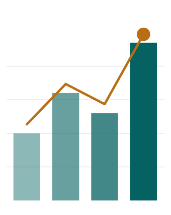

<div align="center">

<picture>
  <source media="(prefers-color-scheme: dark)" srcset="brand/story-dark.svg">
  
</picture>

# بصيرة — BASIRA

**لا تكتفِ بالنظر إلى الأرقام. انظر من خلالها… ببصيرة.**<br>
تطبيق Windows عربي لمديري حسابات التواصل الاجتماعي: يحلّل، ينشر، ويجهّز الحملات الإعلانية — وبياناتك لا تغادر جهازك.

[](https://github.com/SaadHASSON1/basira/releases/latest)
-066262)


[**⬇ تحميل بصيرة**](https://github.com/SaadHASSON1/basira/releases/latest/download/Basira-Setup.exe) ·
[الموقع](https://basira.x13labs.com/) ·
[سجل الإصدارات](CHANGELOG.md) ·
[سياسة الخصوصية](https://basira.x13labs.com/privacy.html) ·
[English](#english)

</div>

---

## ما هي بصيرة؟

مدير الحسابات يفتح كل يوم أربع منصات، ويجمع الأرقام يدويًا، ويخمّن ما الذي نجح. **بصيرة تجمع كل ذلك في شاشة واحدة**، لكل عميل على حدة، وتشرح بالعربية ماذا حدث ولماذا وما الخطوة التالية.

| | |
|---|---|
| 📊 **أداء كل الحسابات** | المشاهدات والوصول والتفاعل والمتابعون من YouTube وFacebook وInstagram وTikTok، يومًا بيوم، دون خلط بين العملاء. |
| 🧠 **محلّل يكتب بالعربية** | تقارير أسبوعية وخطط نمو من أرقام الحساب نفسه. أي رقم ليس في البيانات يُرفض — لا اختلاق. |
| 🎬 **انشر مرة واحدة** | ارفع الفيديو، اختر الغلاف وتفاصيل كل منصة والموعد، فتنشره بصيرة على YouTube وFacebook وInstagram. |
| 📣 **حملات بموافقتك** | حملة Meta أو Google Ads كاملة مع سببها وتكلفتها، تُفحص ضد سقف إنفاقك، ولا يُصرف قرش قبل موافقتك عليها بعينها. |
| 🔔 **تنبيهات** | هبوط مفاجئ، إنفاق قارب السقف، ربط يوشك أن ينتهي — في التطبيق وعلى هاتفك عبر Telegram. |
| 💾 **نسخ احتياطي** | نسخة يومية تلقائية، وثانية في Google Drive أو OneDrive إن أردت. |

## خصوصيتك أولًا

- **لا خادم ولا حساب ولا تسجيل.** بصيرة تعمل على جهازك فقط، ولا يصلنا شيء من بياناتك.
- الربط بكل منصة عبر **شاشة تفويضها الرسمية**، ويمكن إلغاؤه في أي لحظة.
- رموز التفويض والمفاتيح في **مخزن بيانات الاعتماد في Windows** — لا في ملف ولا في سجل.
- **لا نشر ولا إنفاق** دون موافقة صريحة على ذلك المنشور أو تلك الحملة.

التفاصيل الكاملة والصلاحيات المطلوبة لكل منصة: [سياسة الخصوصية](https://basira.x13labs.com/privacy.html).

## التثبيت

1. حمّل [`Basira-Setup.exe`](https://github.com/SaadHASSON1/basira/releases/latest/download/Basira-Setup.exe) (نحو 60 ميغابايت).
2. شغّله. يُثبَّت لمستخدمك فقط ولا يطلب صلاحيات مدير.
3. إن ظهرت رسالة **«Windows protected your PC»**: اضغط **More info** ثم **Run anyway** — البرنامج جديد ولم يُوقَّع رقميًا بعد.
4. افتح **بصيرة** من سطح المكتب، أضف عميلًا، واربط حساباته.

**المتطلبات:** Windows 10 أو 11 (64-بت)، ونحو 250 ميغابايت. المحلّل المحلي يستفيد من كرت شاشة؛ وبدونه يمكنك اختيار Claude السحابي بمفتاحك.

> **مرحلة إطلاق خاص:** ربط الحسابات يحتاج تطبيقات مطوّر مفعّلة على كل منصة. [راسلنا](mailto:saadhassun37@gmail.com) لتحصل على الإعداد.

## ما في هذا المستودع

هذا المستودع يستضيف **موقع بصيرة** (GitHub Pages) و**ملفات التثبيت** في [الإصدارات](https://github.com/SaadHASSON1/basira/releases). شيفرة التطبيق نفسها خاصة.

```
index.html          الصفحة الرئيسية وقصة الأعمدة التي تصير عينًا
hero.js             حركة الشعار عند التمرير (GSAP + MorphSVG)
privacy.html        سياسة الخصوصية (إنجليزي + عربي)
terms.html          شروط الاستخدام
oauth/meta.html     صفحة العودة من تفويض Meta — تعيد الرمز إلى التطبيق على جهازك (127.0.0.1) فقط
brand/              الشعار بصيغه، والحركة المستقلة لهذا الملف
tools/story_svg.py  يولّد brand/story-*.svg
```

---

<div id="english" dir="ltr">

## English

**Basira** is a Windows desktop app for social media managers. It collects performance data from **YouTube, Facebook, Instagram and TikTok** for each client's accounts, writes data-grounded reports in Arabic, publishes videos to YouTube, Facebook and Instagram, and prepares **Meta and Google Ads** campaigns — nothing is published and no money is spent without the user's explicit approval of that specific post or campaign.

It is **local-first**: no Basira server, no sign-up. Platform access is granted through each platform's official authorization screen and can be revoked at any time; tokens live in Windows Credential Manager.

[Download](https://github.com/SaadHASSON1/basira/releases/latest/download/Basira-Setup.exe) · [Privacy Policy](https://basira.x13labs.com/privacy.html) · [Terms](https://basira.x13labs.com/terms.html) · Contact: saadhassun37@gmail.com

</div>

<div align="center"><sub>© 2026 بصيرة — BASIRA. جميع الحقوق محفوظة.</sub></div>
